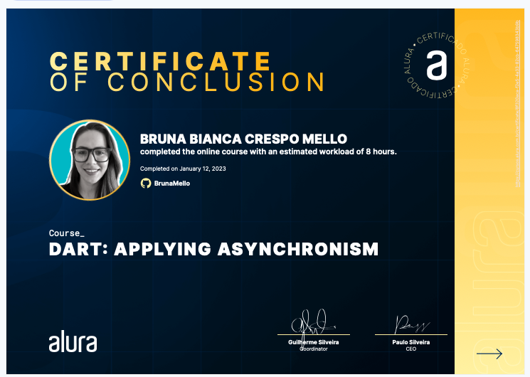

<h1>Flutter: Asynchronous</h1>

Take this Flutter course and:

- Learn about the importance of asynchronous in programming
- Implement improvements to a practical project that simulates a bot (artificial intelligence) in the console of an IDE
- Make a bot more humanized and able to recognize and respond to messages in "good manners" (e.g., good morning, good afternoon)
- Apply Dart asynchronous techniques: future, delayed, stream e, async* and async/await
- Treat errors in codes that may take time
- Produce an asynchronous loop
- Learn what a single thread language is and the difference between isolated and loop events

Certificate: 'https://cursos.alura.com.br/certificate/8f320aca-f2e5-4a33-82cb-647598343b9b'

